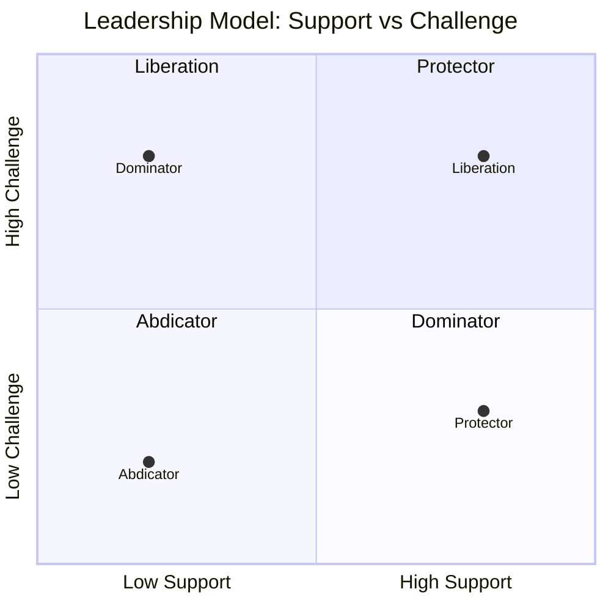

# 2026-03-11

## 🎯 Focus Today

Learning a leadership principle based on **Support** and **Challenge**.

---

## 📚 What I Learned

Hôm nay tôi học được một nguyên lý khá thú vị về leadership.
Một người leader không chỉ cần **support (hỗ trợ)** mà còn cần **challenge (thử thách)** đội ngũ của mình.

Tùy vào mức độ của hai yếu tố này mà môi trường làm việc được tạo ra sẽ hoàn toàn khác nhau.

Today I learned a leadership framework based on two dimensions:

* **Support** – how much help, guidance, and care a leader provides.
* **Challenge** – how much a leader pushes people to grow and perform.

Depending on these two factors, leadership can create four different environments.
---

## 📊 Leadership Model

---

## 🧭 Leadership Types

### Abdicator

Low Support + Low Challenge

Environment created:

* Apathy
* Low expectations

Ít support và ít challenge sẽ tạo ra môi trường **thờ ơ**.
Mọi người không cảm thấy được quan tâm, cũng không bị thúc đẩy để phát triển.

---

### Protector

High Support + Low Challenge

Environment created:

* Entitlement
* Mistrust

Nhiều support nhưng ít challenge có thể khiến mọi người cảm thấy **quá an toàn hoặc được nuông chiều**, từ đó dễ sinh ra entitlement.

---

### Dominator

Low Support + High Challenge

Environment created:

* Fear
* Manipulation

Nếu chỉ có challenge mà thiếu support, môi trường sẽ dễ trở nên **áp lực và sợ hãi**.
Con người có thể làm việc vì sợ thay vì vì động lực phát triển.

---

### Liberation

High Support + High Challenge

Environment created:

* Empowerment
* Opportunity

Đây là môi trường lý tưởng: vừa **được hỗ trợ**, vừa **được thử thách để phát triển**.

---

## 🧠 Thoughts

Mô hình này làm tôi nhận ra rằng leadership tốt không chỉ là hỗ trợ người khác.

Nếu chỉ support mà không challenge thì mọi người sẽ dễ rơi vào trạng thái **comfort zone**.

Ngược lại, nếu chỉ challenge mà không support thì môi trường sẽ trở nên **stress và tiêu cực**.

Có lẽ leadership tốt là khi vừa **giúp đỡ**, vừa **thúc đẩy người khác vượt qua giới hạn của mình**.

---

## 🔗 Related Notes

* [[leadership-principles]]
* [[personal-growth]]

---

## 🏷 Tags

#daily
#leadership
#learning
